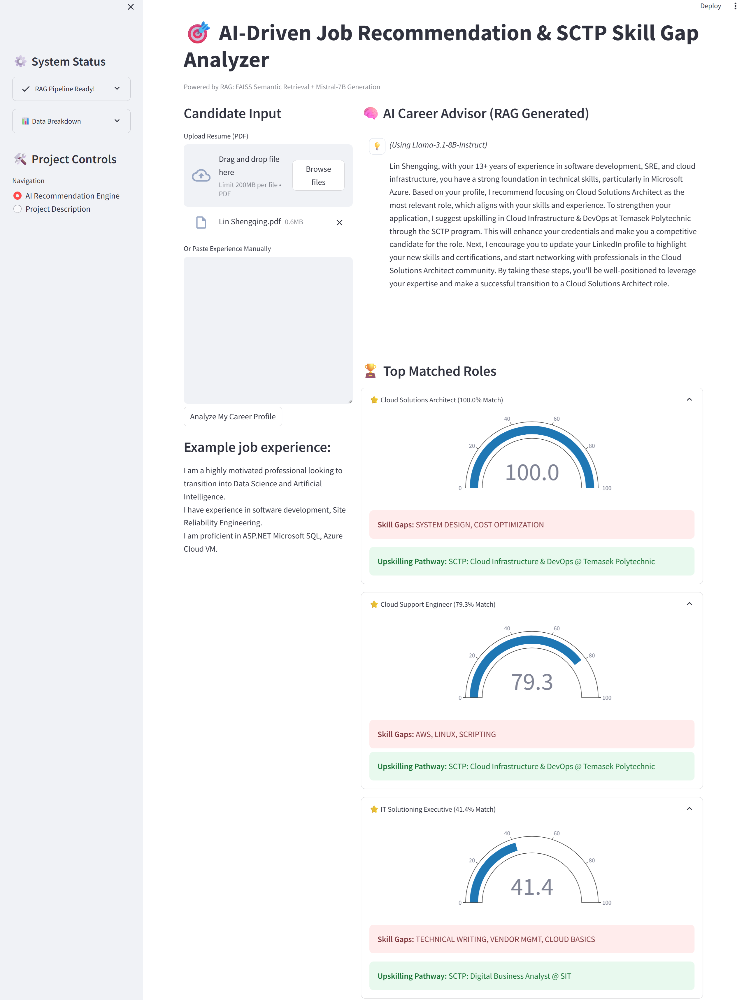
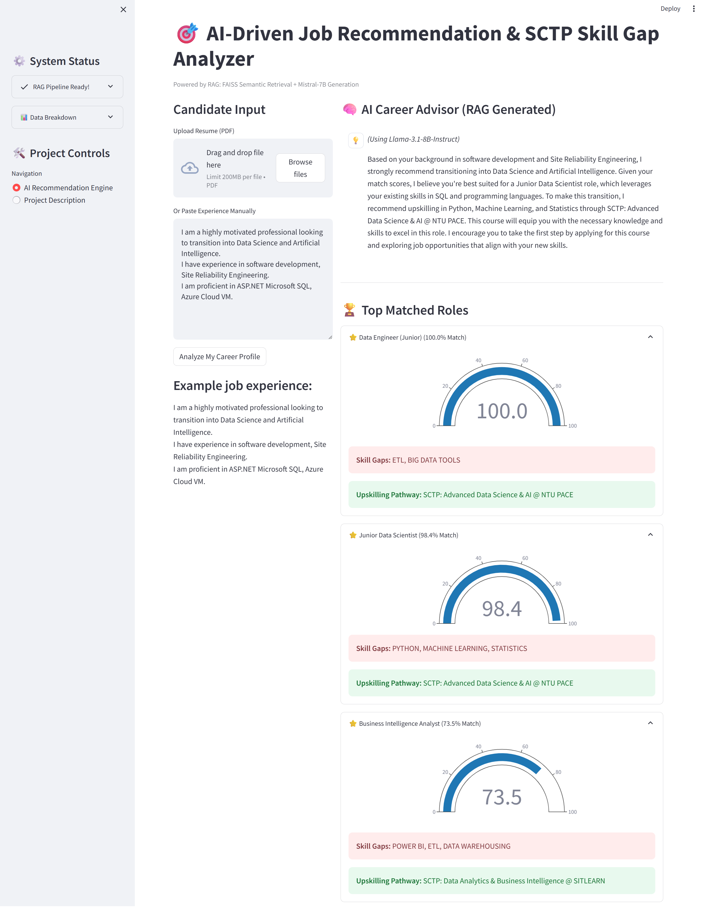
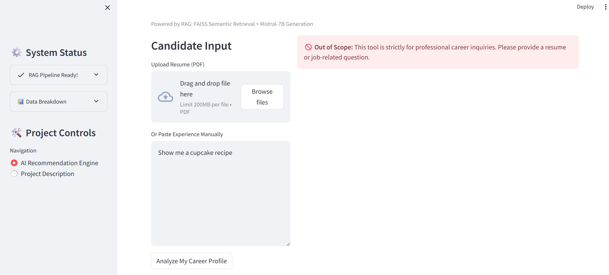

# 🚀 AI-Driven Job Recommendation & SCTP Skill Gap Analyzer

## 📌 Project Overview
A functional AI prototype built to solve the job-matching friction in the Singapore market. The application identifies technical gaps between a candidate's resume and current job requirements, then maps those gaps to specific **2026 SCTP training modules**.

---

## 🎯 Problem Statement
Singaporean job seekers, especially mid-career professionals, often face:
* **Hidden Skill Gaps:** Difficulty identifying exactly which technical delta prevents them from landing a role.
* **Contextual Mismatches:** Standard keyword-based search fails to recognize transferable skills from previous industries.
* **Upskilling Fragmentation:** Difficulty mapping job requirements to the correct SkillsFuture Career Transition Programme (SCTP).

---

## 🧠 Technical Methodology (RAG Pipeline)
The system operates as a full **Retrieval-Augmented Generation (RAG)** pipeline, moving beyond simple keyword matching to provide semantic understanding and personalized AI generation.

### 1. Vector Store & Semantic Retrieval
Instead of keyword matching, this tool utilizes the **`BAAI/bge-small-en-v1.5`** Sentence-Transformer model. At startup, it converts curated job requirements into high-dimensional vectors. It then checks for a locally persisted **FAISS** index on disk; if found, it loads it instantaneously, otherwise it builds and persists a new one. When a candidate uploads a resume, the system queries this index to retrieve the most semantically relevant roles.

### 2. Cross-Encoder Re-Scoring
To ensure high precision on the retrieved candidates, the engine applies a secondary re-ranking phase:
* **Initial Retrieval:** Fetches a broad candidate pool (Top 15) using fast Cosine Similarity (bi-encoder).
* **Deep Re-Ranking:** Passes the candidate profile and the Top 15 jobs through a dedicated **Cross-Encoder (`cross-encoder/ms-marco-MiniLM-L-6-v2`)**. The cross-encoder evaluates the nuanced relationship between the exact candidate's skills and the specific job document to output the final Top 3 results.

### 3. Score Calibration (UX Optimization)
Raw semantic similarity coefficients typically fall between 0.3 and 0.5. The app applies a **linear calibration layer** to map these raw scores to a 0–100% human-legible scale, ensuring the "Match Percentage" aligns with user expectations.

### 4. LLM Generation Layer (AI Career Advisor)
Once the top matches and skill gaps are identified, the system constructs a context-rich prompt formatted with XML tags (`<candidate_profile>`, `<job_matches>`) for better instruction adherence. It then calls the **Hugging Face Inference Providers API** (`huggingface_hub`) to stream personalized, actionable career transition advice directly to the UI in real-time.

**Model Selection:**
The system uses a dynamic fallback array of open-weight LLMs hosted on Hugging Face's free Serverless Inference API to ensure stability and high reasoning quality.

**System Resilience & Fallback Logic**
Unlike standard RAG apps that rely on a single point of failure, this engine implements a Tiered Inference Strategy. If the primary model (Llama-3.1) is rate-limited or unavailable, the system automatically cascades through backup high-reasoning models:
1. **`meta-llama/Llama-3.1-8B-Instruct`** (Primary): Highly capable, fast, and excellent at following complex system prompts.
2. **`Qwen/Qwen2.5-72B-Instruct`** (Fallback 1): A massive, exceptionally powerful model that rivals proprietary models in reasoning.
3. **`mistralai/Mistral-Nemo-Instruct-2407`** (Fallback 2): A highly efficient 12B parameter model built jointly by Mistral and Nvidia.

### 5. Data Ingestion
* **Seed Database:** Utilizes a custom `roles.json` containing 100+ diverse industry roles.
* **Course Database:** Utilizes `sctp_courses.json` containing SCTP courses to fulfill skill gaps. 

---

## 📁 File Structure
* **app.py**: Core application logic, RAG pipeline, FAISS indexing, and Streamlit UI.
* **roles.json**: Curated database of 100 diverse job roles and requirements.
* **sctp_courses.json**: Mapping of job categories to actual SCTP course providers (NTU, SUTD, SIT, etc.).
* **requirements.txt**: Python dependencies (Sentence-Transformers, PyPDF, FAISS, huggingface-hub).

---

## 🛡️ Ethics & Data Privacy

* **Intent Guardrails**: The system utilizes a **"Semantic Gatekeeper"** prompt. If a user provides input unrelated to career history or job seeking, the LLM is instructed to politely decline, preventing the tool from being used as a general-purpose chatbot.
* **PDPA Aligned**: All resume processing is done in-memory. No personal data or uploaded PDFs are stored permanently.
* **Bias Reduction**: Matching is purely mathematical (vector-based), ignoring demographic indicators such as age, gender, or race.
* **Transparency**: Clearly identifies **"Skill Gaps"** to provide users with actionable feedback rather than a simple "Yes/No" result.
* **Industry Partner**: FindSGJobs

---

## 🚀 Future Roadmap

To evolve **My AI Career Advisor** from a functional capstone prototype into a production-ready ecosystem for the Singapore job market, the following development phases are planned:

### 🔹 Phase 1: Data & Intelligence Scaling (Short-term)
* **Live Job Feed Integration**: Transition from a static `roles.json` to real-time API integrations with platforms like **MyCareersFuture** or **LinkedIn** to ensure recommendations reflect current market demand.
* **Agentic Search Capabilities**: Implement an **AI Agent** (using LangGraph) to autonomously browse the web for the latest SCTP course intake dates and seat availability, providing real-time enrollment guidance.
* **Multilingual Support**: Enhance the RAG pipeline to process resumes and provide advice in multiple languages, supporting Singapore’s diverse workforce.

### 🔹 Phase 2: Personalized Career Tooling (Mid-term)
* **AI Resume Tailor**: A generative module that doesn't just identify gaps but suggests specific "Action Verbs" and phrasing to help candidates better highlight transferable skills for a target role.
* **AI Interview Simulator**: A voice-enabled mock interview module that generates questions based on the specific job requirements identified during the matching phase.
* **Salary Benchmarking**: Integration with **MOM/NTUC salary datasets** to provide users with realistic expected salary ranges for their suggested career transitions.

### 🔹 Phase 3: Ecosystem & Infrastructure (Long-term)
* **Production Vector Database**: Migrate from a local FAISS index to a managed cloud vector database (e.g., **Pinecone** or **Weaviate**) to support high-concurrency and global scaling.
* **Direct SCTP Enrollment**: Establish API handshakes with training providers (NTU, SIT, SUTD) to allow users to "Express Interest" or begin the enrollment process directly from the app interface.
* **User Profiles & Progress Tracking**: Implement a secure authentication layer so users can save their "Skill Gap" history and see their match percentages increase as they complete recommended SCTP modules.

---

## 🌟 Project Showcase

### 📸 App Infographic 


---

### 📊 Presentation
To understand the architecture and business value behind this project, please view the presentation slides:
- 📑 [View as PDF](assets/My_AI_Career_Advisor_Slide.pdf)

---

### 🎥 Demo Video 

Check out this quick walkthrough of the application:
<video src="assets/My_AI_Career_Advisor_Video.mp4" width="800" controls="controls"></video>

*(If the video doesn't load, you can [download it here](assets/My_AI_Career_Advisor_Video.mp4))*

---

### 🌟 App Demo Link

Check Out the app via this link (https://huggingface.co/spaces/linshengqing/Capstone-FindSGJobs)

---

### 📸 App Screenshots 

Candidate upload their resume PDF file, the app will shows the top matched roles and a short advise by a RAG generated AI Career Advisor.



---

The app also suports manaully keying in their experience.



---

Guardrails to prevent the app from generating irrelevant responses.



---

## 🛠️ Installation (Conda Workflow)

1. **Create the environment**:
   ```bash
   conda env create -f environment.yml
2. **Activate the Environment**:
   ```bash
   conda activate capstone_findsgjobs
3. **Add .env file for Hugging Face HF_TOKEN**:
   ```bash
    HF_TOKEN=hf_your_actual_token_here
4. **Run the streamlit app**:
   ```bash
   streamlit run app.py
